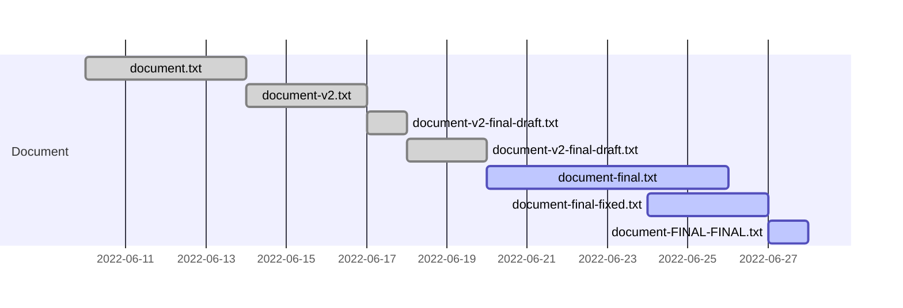

# DataTrain | OT-ST-WS-06 | Git / GitHub

## 0. Preparation

Before attending the course, follow the steps in the [Setup guide](documentation/00-setup-your-environment.md).

## 1. Onboarding 

Before we start. Lets check your [check your configuration](excercises/01.md) first.

## 2. Why using a version control system

### 2.1 Iterations of working documents

When I worked on a document, I started with a file, let's call it `document.txt`.
As the work progressed, for example when updating the layout, I didn't want to lose anything and renamed the file to `document-v2.txt`.
Now the madness begins. I send this file to a friend to review it. They send me their feedback, and I work it into a file called `document-v2-final_draft.txt`. I send this to another friend and collect their feedback in `document-v2-final_draft2.txt`. 
Finally, I finish the document and name it `document-final.txt`. Before I print or publish it, I ask my dear mother to review it, and you may have guessed it, she sends me back the file `document-final-fixed.txt`. I look at the changes and find a few more problems, so I have this file `document-FINAL-FINAL.txt`.

At this point, my project folder will look something like this:

```bash
my-project
├── document.txt
├── document-v2.txt
├── document-v2-final_draft.txt
├── document-v2-final_draft2.txt
├── document-final.txt
├── document-final-fixed.txt
└── document-FINAL-FINAL.txt
```

Even worse, these files can be active at the same time, as I may be making changes to the `document-final.txt` file while someone else is correcting the same file I sent them.



Now imagine what this might look like for projects with multiple files, such as source code or larger projects like books, papers, and so on.

In the early era of software development in the 1960s and 1970s, the need arose for a system to manage these changes in a logical way. The first [Source Code Control System](https://en.wikipedia.org/wiki/Source_Code_Control_System) was developed in 1972. Later, other version control systems were developed. The most commonly used system is the one we are talking about today.

### 2.2 A version control system?

With books, there are different editions. When the content is updated, the edition is increased. This has been done for hundreds of years. Most books are written by a single person, and when they are edited in collaboration, people tend to divide the chapters. Working on a book in the traditional way and in collaboration with other people is very labor intensive.
The work of software engineers in the 1960s was spread across mainframes and thousands of lines of code, which are not as easy to read as prose. Mistaking a lowercase L for a capital i isn't wild in novels, but in the software world it quickly leads to bugs.

That's why VCS were developed. But what should they be able to do anyway?

- Track changes across multiple files
- Compare different versions
- Restore a previous state
- Collaborate with other people

The first VCS was just the beginning, others were developed after to meet changing needs.

- [RCS](https://www.gnu.org/software/rcs/) (1982)
- [CVS](http://cvs.nongnu.org/) (1990)
- [SVN](https://subversion.apache.org/) (2000)
- [Mercurial](https://www.mercurial-scm.org/) (2005)
- [Git](https://git-scm.com/) (2005)

### 2.3 What is git?

> Git is a free and open source distributed version 
> control system designed to handle everything from 
> small to very large projects with speed and efficiency.
> 
> [git-scm.com](https://git-scm.com/)

After some controversy, Linus Torvalds was looking for a version control system to use for the development of the Linux kernel.
Unable to find a solution that met his requirements, he began developing git in 2005.
Due to the high status of the Linux kernel in the developer community, git became popular quite quickly.

Every year, [StackOverflow](https://stackoverflow.com/) collects answers from its users. One question they ask is about VCS. 

For years, the use of Git has been on the rise. Ten years after its initial release, Git was already used by 69.3% of StackOverflow survey respondents.
In the most recent 2022 survey, 93.87% of 71,379 people responded that they use Git as their preferred version control system.


[StackOverflow Survey 2022 - VCS](https://survey.stackoverflow.co/2022/#section-version-control-version-control-systems)

