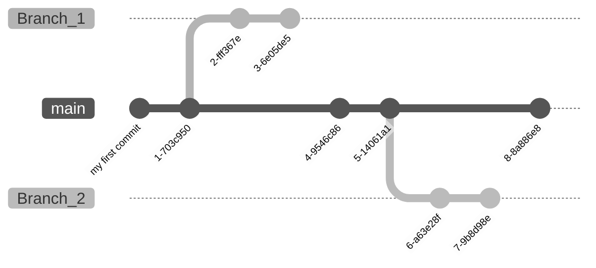
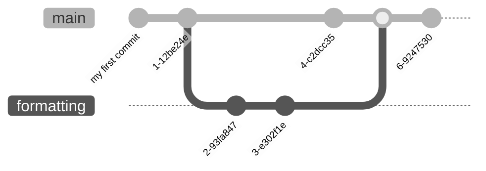
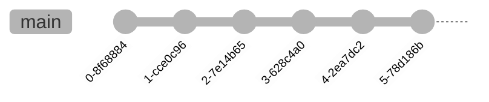
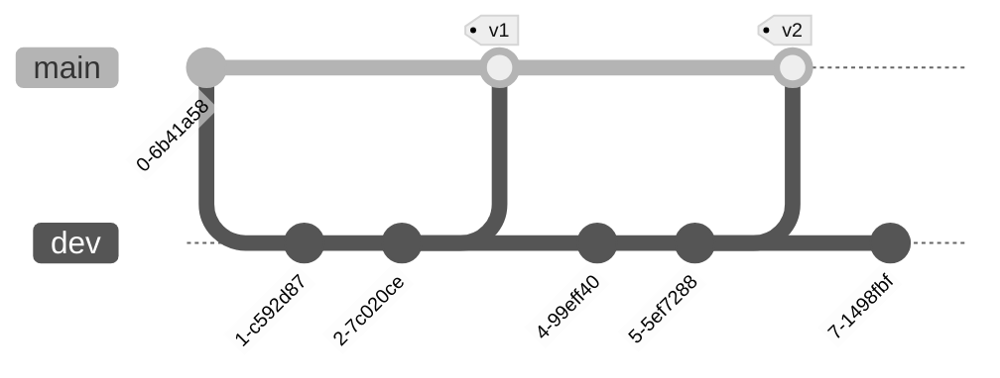

# DataTrain 2022 | OT-ST-WS-06 | Git / GitHub

## 0. Preparation

Before attending the course, follow the steps in the [Setup guide](documentation/00-setup-your-environment.md).

## 1. Onboarding 

Before we start. Lets check your [check your configuration](exercises/01.md) first.

## 2. Why using a version control system

### 2.1 Iterations of working documents

When I worked on a document, I started with a file, let's call it `document.txt`.
As the work progressed, for example when updating the layout, I didn't want to lose anything and renamed the file to `document-v2.txt`.
Now the madness begins. I send this file to a friend to review it. They send me their feedback, and I work it into a file called `document-v2-final_draft.txt`. I send this to another friend and collect their feedback in `document-v2-final_draft2.txt`. 
Finally, I finish the document and name it `document-final.txt`. Before I print or publish it, I ask my dear mother to review it, and you may have guessed it, she sends me back the file `document-final-fixed.txt`. I look at the changes and find a few more problems, so I have this file `document-FINAL-FINAL.txt`.

At this point, my project folder will look something like this:

```bash
my-project
├── document.txt
├── document-v2.txt
├── document-v2-final_draft.txt
├── document-v2-final_draft2.txt
├── document-final.txt
├── document-final-fixed.txt
└── document-FINAL-FINAL.txt
```

Even worse, these files can be active at the same time, as I may be making changes to the `document-final.txt` file while someone else is correcting the same file I sent them.


Now imagine what this might look like for projects with multiple files, such as source code or larger projects like books, papers, and so on.

In the early era of software development in the 1960s and 1970s, the need arose for a system to manage these changes in a logical way. The first [Source Code Control System](https://en.wikipedia.org/wiki/Source_Code_Control_System) was developed in 1972. Later, other version control systems were developed. The most commonly used system is the one we are talking about today.

### 2.2 A version control system?

With books, there are different editions. When the content is updated, the edition is increased. This has been done for hundreds of years. Most books are written by a single person, and when they are edited in collaboration, people tend to divide the chapters. Working on a book in the traditional way and in collaboration with other people is very labor intensive.
The work of software engineers in the 1960s was spread across mainframes and thousands of lines of code, which are not as easy to read as prose. Mistaking a lowercase L for a capital i isn't wild in novels, but in the software world it quickly leads to bugs.

That's why VCS were developed. But what should they be able to do anyway?

- Track changes across multiple files
- Compare different versions
- Restore a previous state
- Collaborate with other people

The first VCS was just the beginning, others were developed after to meet changing needs.

- [RCS](https://www.gnu.org/software/rcs/) (1982)
- [CVS](http://cvs.nongnu.org/) (1990)
- [SVN](https://subversion.apache.org/) (2000)
- [Mercurial](https://www.mercurial-scm.org/) (2005)
- [Git](https://git-scm.com/) (2005)

### 2.3 What is git?

> Git is a free and open source distributed version 
> control system designed to handle everything from 
> small to very large projects with speed and efficiency.
> 
> [git-scm.com](https://git-scm.com/)

After some controversy, Linus Torvalds was looking for a version control system to use for the development of the Linux kernel.
Unable to find a solution that met his requirements, he began developing git in 2005.
Due to the high status of the Linux kernel in the developer community, git became popular quite quickly.

Every year, [StackOverflow](https://stackoverflow.com/) collects answers from its users. One question they ask is about VCS. 

For years, the use of Git has been on the rise. Ten years after its initial release, Git was already used by 69.3% of StackOverflow survey respondents.
In the most recent 2022 survey, 93.87% of 71,379 people responded that they use Git as their preferred version control system.


[StackOverflow Survey 2022 - VCS](https://survey.stackoverflow.co/2022/#section-version-control-version-control-systems)

#### But what exactly is git?

Git is a command line tool with a large number of commands for controlling changes to your files. If you call the help information via `git --help` after installation, you will get an overview of the available commands.

```
$ git --help       
usage: git [--version] [--help] [-C <path>] [-c <name>=<value>]
           [--exec-path[=<path>]] [--html-path] [--man-path] [--info-path]
           [-p | --paginate | -P | --no-pager] [--no-replace-objects] [--bare]
           [--git-dir=<path>] [--work-tree=<path>] [--namespace=<name>]
           [--super-prefix=<path>] [--config-env=<name>=<envvar>]
           <command> [<args>]

These are common Git commands used in various situations:

start a working area (see also: git help tutorial)
   clone     Clone a repository into a new directory
   init      Create an empty Git repository or reinitialize an existing one

work on the current change (see also: git help everyday)
   add       Add file contents to the index
   mv        Move or rename a file, a directory, or a symlink
   restore   Restore working tree files
   rm        Remove files from the working tree and from the index

examine the history and state (see also: git help revisions)
   bisect    Use binary search to find the commit that introduced a bug
   diff      Show changes between commits, commit and working tree, etc
   grep      Print lines matching a pattern
   log       Show commit logs
   show      Show various types of objects
   status    Show the working tree status

grow, mark and tweak your common history
   branch    List, create, or delete branches
   commit    Record changes to the repository
   merge     Join two or more development histories together
   rebase    Reapply commits on top of another base tip
   reset     Reset current HEAD to the specified state
   switch    Switch branches
   tag       Create, list, delete or verify a tag object signed with GPG

collaborate (see also: git help workflows)
   fetch     Download objects and refs from another repository
   pull      Fetch from and integrate with another repository or a local branch
   push      Update remote refs along with associated objects

'git help -a' and 'git help -g' list available subcommands and some
concept guides. See 'git help <command>' or 'git help <concept>'
to read about a specific subcommand or concept.
See 'git help git' for an overview of the system.
```

Each of these commands has its own help section. Just append `--help` to a command and you will get a technical description of what that command does. Depending on your system, you will either get the information in your terminal or a browser window will open.
E.g. `git init --help` shows you a _DESCRIPTION_ of what this command does. You also have a list of _OPTIONS_ that you can append to `git init`.

Git is NOT GitHub or GitLab or any other service or software. Git can be used to work with those services, but it must not be confused with them.

### 2.4 Collaboration

Git, as it stands, can be used to collaborate with others. If you are working on a repository that you have obtained in some way, you can use commands like `git format-patch mybranch` to create a patch file that updates someone else's repository with your changes via the command `git am mychanges.patch`. But this is very cumbersome and some people thought this should be simplified. They developed software like GitHub, Gitlab, Bitbucket, Gitea. Some offer their software as open source and/or as a service.

These services and solutions offer features that go far beyond those of Git. From additional ticket systems, project management, wikis, reviews, communities to automation.

The most used platform, according to the StackOverflow survey, is GitHub, which we are talking about today.
More about using GitHub for collaboration is explained in later chapters.


[StackOverflow Survey 2022 - VCS Platforms](https://survey.stackoverflow.co/2022/#section-version-control-version-control-platforms)

## 3. The first repository

You can start setting up your first project. You will use this project for most of today's exercises.

### 3.1 Project initialization

Before you can use most Git commands, you must tell Git that the directory you are in should be a Git repository. To do this, you must use the `git init -b main` command. The `-b main` option is short for `--initial-branch=main` and sets the default branch named _main_. Do not worry now about what are branches.

This will create a hidden directory called `.git`. This directory is the data directory of Git. It contains the entire history of your repository. Do not delete this directory, or you will lose all your version history unless you have moved your repository to another location.

### 3.2 Project changes

When you are inside a git repository one helpful command is `git status`.
The output of this command tells you about the current state of the files.

If you are in a freshly initialized repository, the command will tell you the following:

```bash
$ git status
On branch main

No commits yet

nothing to commit (create/copy files and use "git add" to track)
```

The first line indicates which branch you are currently on. On the main branch".
Next, it tells you that you have "no commits yet". This is only shown for brand new repositories.
The last line says that you have no changes that need to be committed.

But then what are commits?

### 3.3 Commits

A _commit_ is a change you have made to the repository. It can consist of a single line that you changed, or a large number of changes across multiple lines and files. Each commit has a unique 40 character string to identify it.

To create a commit, you must first make changes. In your empty repository, you can create a file called `README.md`. This is a special file that we will look at when we start working with GitHub.

Fill it with some content like a title and text. When you call `git status` again, it will show that you have untracked changes.

To tell Git what changes you want to add to the commit, you need to add those changes with `git add README.md`. This will add all changes to the `README.md` file to the commit. There are other options to add individual lines (`git add --interactive`, `git add --patch`, or GUI tools), but we want to keep it simple for now. You can run this command several times to add more files to the commit.

Another `git status` will indicate that you have changes that need to be committed.
After adding the changes to your commit, you need to finalize it with `git commit -m "<your message>"`.

#### Visualizing commits

Commits build on each other. Each bubble in the graph represents a commit.
As a commit contains only the modifications it depends on the ones before. 


### 3.4 Workspaces

After hearing terms like _working directory_, _staging area_ and _repository_ you might ask, what those things are.


The working directory is your directory on your file system. It is monitored by Git, but the changes are not yet saved, versioned, or included in Git. You must explicitly add the changes to the staging area to track them with Git.
After you add and commit the changes, they end up in the repository on your device. This repository is organized by git within the `.git` directory that you created with the init command.

The stash command, which has not been discussed so far, is a special command. It offers you the possibility to save changes in a _dirty_ working directory. Some commands do not need changed or unconfirmed changes to be executed. With stash you can save these changes temporarily.

## 4. Branches and Merges

One of the main features of Gits is the ability to split off from work and edit files in another workspace based on the current one. 
These workspaces are called branches. You always start with a branch in your Git repository. Usually, this branch is called `main`. Unlike branches in most trees, these can and should be merged with another branch, usually the main branch.

### 4.1 Branches

You start with the `main` branch and create your commits in that branch. If you decide you need another branch, the `git switch --create <new_branch>` command (introduced in Git version 2.23) creates a new branch with the current state of the branch you were in before and switches to it. Now you can make changes to it and commit them to this new branch. Your original branch will not be affected by these commit. 
You can switch between these branches at any time, e.g. `git switch main` to return to your main branch.



Typically, other branches are used to work on a new feature for a piece of software or a new chapter or section of a book. Another use case could be that you are working on an essay and want to try a different way of formatting. Then it makes sense to create a new branch just for those experiments. You can keep your original work, but at the same time work on something you're not sure yet if it will be kept. Once you know what you want to do with the formatting branch, you can either delete it with `git branch --delete <branch_name>` after switching to some other branch, or you can merge the changes commited to this branch to the main branch.
 
### 4.2 Merging

When you have concluded that you want to merge your changes from the other branch with the main branch, you need the `git merge` command. 

Suppose you made some commits to the main branch before you created the _formatting_ branch. You changed the formatting and applied some changes to the main branch as well. The git graph would then look something like this:


Then you decide to merge the changes of the _formatting_ branch into the main branch. You first switch to main with `git switch main` and then merge the changes of the _formatting` branch with `git merge formatting`.
The resulting graph looks like this.


If no changes to the main branch conflict with the branch being merged, Git simply appends the commits to the existing commits of the main branch. Otherwise, there are merge conflicts that must be resolved.

### 4.3 Merge conflicts

If you are working on multiple branches, sometimes there are conflicts when merging. This is because Git cannot decide which lines to remove or move to a different location. This usually happens when you edit the same lines in a file in multiple branches. 

For example: you are working on a book. Since you are working on the different chapters at the same time, you have created a repository with a main branch containing a file with the title and started creating branches for each chapter.
Lines 1-5 of the file are used for the title and some structural elements. After you finish the first chapter, merge it without conflicts. Git merges the changes in lines 6-75. Now you also finish chapter 4, but it too starts at line 6 and lasts until line 120. Git doesn't know how to handle the merge of the fourth chapter.

If you merge a branch that results in a merge conflict, Git will alert you with a message like this:

```
Auto-merging <filename>
CONFLICT (content): Merge conflict in <filename>
Automatic merge failed; fix conflicts and then commit the result.
```

Within the conflicting file(s), Git has added some additional lines with a somewhat confusing syntax.
Even if it looks strange at first, it helps to fix the conflicts.

```
<<<<<< HEAD
This line was already within the main branch
======
This was added within the conflicting branch
>>>>>> conflicting_branch_name
```

The first line `<<<<<< HEAD` introduces a new term, HEAD. Git uses several pointers to make it easier for you to change the current state of the repository. The HEAD pointer points to the last commit hash of a branch.
The part between `<<<<<< HEAD` and `======` contains all the text you currently have in your branch.
Everything between `======` and `>>>>>> conflicting_branch_name` contains the changes that conflict with the text you already have, and that come from the branch named `conflicting_branch_name`.
Git doesn`t know whether this text needs to be merged, concatenated, or discarded.

- When you want to discard the changes in HEAD, you would delete the part from `<<<<<< HEAD` till `======`. Also you need to remove `>>>>>> conflicting_branch_name`
- When you want to discard the changes from the conflicting branch, you would delete the part from `=====` and `>>>>>> conflicting_branch_name` and also delete `<<<<< HEAD`
- When you want to merge or concatenate them, you need to order the text manually and delete `<<<<< HEAD`, `======` and `>>>>>> conflicting_branch_name`

When you have fixed the problems in the conflicting files. The next step is to add all the files to the staging area and commit them at once. Git creates an additional merge commit with all the changes required to resolve the conflict. 



## 5. Git History

Everything you do to git is stored in a history. With this history you can the state of your repository. Simillar to switching branches, when using commit hashes or tags you can set the state of your repository to this commit.

### 5.1 Logs

To access the history of git the command `git log` and the many options it provides will show you. The simplest command `git log` provides an output that states the hash, author, date and message of a commit.

```
commit 990a517a04ab89f2ffd99d93b22ac99172772609
Author: Your Name <your-mail@example.com>
Date:   Sun Jul 11 12:36:11 2022 +0200

    my first commit
```

To get a graph that is similar to the ones here the command `git log --all --graph --oneline` will create one. 

```
* ae00104 add AUTHORS file
* 6a7ba4a add new line to README.md
* 990a517 my first commit
```

The `git log` command has a lot of options to choose from. In the examples above, I used `--graph` to create a graph view. Since this graph would span all the details of my history, I also used `--oneline` to reduce the output of `git log` to just one line per commit.

### 5.2 Tags

To expand Git's list of pointers and have some more readable ones, Git supports tags. You can tag any commit in any branch of your repository. The tag can be simple and include just the tag name, but it can also include information about the author, a date, or your digital signature. Tags can also contain a message, as commits do. In software development, this is often used to mark a point in a release, such as _v1.12_.
When distributing software, the developer can then create a hotfix for that version only, rather than updating the software stack on the client from _v1.12_ to the current version, which may be _v2.7_ and bring a lot of breaking changes.

If you want to search a repository and list all tags, the `git tag --list` command displays all them. You can also filter for tags by appending a string and a wildcard, for example `git tag --list v2*`.

To create a tag, you need to know where you want to do it. The default `git tag` creates a one for the commit you just checked out. You can create a lightweight tag, simply enter the command and a name for the it, such as `git tag first-tag`. You may want to attach a message to the tag, add `-m "your message"` to the command.

If you want to create a commit that you created in the past, you can pass the commit hash to the tag command, and it will add that tag to the specified commit, for example `git tag <tag_name> <commit_hash>`. 

To show the content of a tag just enter `git show <tag_name>` and it will show the tag and commit details. 

### 5.3 Project travel
 
But what are all those tags and commit hashes worth?

By now you already switched between branches. The commit hashes allow you to check out any commit you or someone else commited. This will bring your working directory to the state the repository had when the commit was created. To do that you need the `git checkout <commit_hash>` command.

You may create a new branch now or check out another commit, tag or branch.

To simplify going to specific commits of value we can use git tags. The command is the same as before, but now you enter the tag name (`git checkout <tag_name>`).

## 6. GitHub

There are many services that offer additional functionality around Git. One of the biggest is GitHub, which is now part of Microsoft. The features that this service offers go beyond the capabilities of Git. You can create a wiki, issues, discussions, project management and automation on GitHub. The service is also focused on collaboration on repositories.
 
### 6.1 Publish a project on GitHub

Let us start publishing the project you were working on. To do that you first must [create a new project on GitHub](https://github.com/new).


The form asks for all kinds of information you currently do not need. After creating the repository GitHub will redirect you to the quick setup examples on how to fill your repository with files.


After creation, you need to customize your local Git repository. It does not know anything about the project on GitHub yet. The command to add remotes is `git remote add <remote_name> <remote_url>`. A common convention for the remote name is `origin`.
If you did not name your branch `main`, you can rename it now with `git branch -M main`.
The last thing you need to do is upload the contents of your repository to the remote project. The command `git push` will do that. But git doesn`t know at the moment to which branch on the remote side you want to upload your commits. So you need to add the `--set-upstream <remote_name> <branch_name>` option. The full command is `git push --set-upstream origin main`.

Now the contents of your repository can also be found on GitHub.

### 6.2 Working with remotes
 
To work with remotes, git provides a number of commands.

- `git clone`
- `git fetch`
- `git pull`
- `git push`

The clone command is used to download a repository from a remote repository such as GitHub to your local storage.
To update your local repository with the contents of a remote repository, but without changing your workspace, you can use the fetch command. To also update your workspace, use the pull command.
To upload your commits in the local repository to a remote repository to which you have push access, use the push command.


### 6.3 Special files

During the creation of your project you may have read terms like `README.md` and `.gitignore`. These are special files for Git and also for GitHub. There are other special files you can read about in the git and GitHub documentation. But two of then are used pretty often, the `.gitignore` and the `README.md`.

#### .gitignore

This file tells git what to ignore. Sometimes you have files in your local working directory that you never want to commit. These can be files that your operating system, editor, or other programs generate. For example, if you wrote a paper in Latex, you don't need to include the PDF and other temporarily generated files because anyone can generate them.
You should also not commit files with passwords, especially to a public repository, as anyone can read them.

#### README.md

If you have created a file named `README.md`, you will now see why it is special to GitHub (and other services).
There are also other formats for this file. This format includes [Markdown](https://www.markdownguide.org/basic-syntax) to structure text as headings, etc.
On GitHub, this file is the first to be presented to a viewer. You can use this file to describe how to use your project, specify the contributors, or whatever you have in mind that you want others to read first.
 
### 6.4 Collaboration

The most used form of collaboration on GitHub is through _pull requests_.
 
#### Pull Requests

A pull request has some special features on GitHub. When you create a pull request, you can discuss your changes with other participants. GitHub also checks if there are any merge conflicts that need to be resolved first.
All comments and commits are visible in the pull request and can be easily tracked.
 
#### You are a collaborator to a GitHub project

You can work with this project the same way as you would on your personal repository. 

#### You want to update a public GitHub project
 
1. On GitHub fork the project [DataTrain-2022-OT-ST-WS-06](https://github.com/nharms-awi/DataTrain-2022-OT-ST-WS-06)
2. In your terminal run these commands

```bash
# Clone the fork of project to your device
git clone git@github.com:<your_github_username>/DataTrain-2022-OT-ST-WS-06.git
# Add the upstream repository to your project
git remote add upstream git@github.com:nharms-awi/DataTrain-2022-OT-ST-WS-06.git
```

3. Now you want to start working on your changes.

```bash
# First we want to create a new branch, as we never want to modify the main branch
git switch -c myfeature
```

4. Track your branches with the remote

```bash
# Push all local branches to your origin and set up tracking
git push --all --set-upstream
```

5. Modify your project, create commits and push them to your fork.

6. Create a pull request

### 6.5 Other Features

Some other features that GitHub offers are wikis, an issue tracker, project management and automation. With wikis you can go into more detail, for example, if you have a software repository and you want to have guidance for users.
The issue tracker and projects are good for managing your project and seeing what still needs to be done. You can write down rough ideas of what you want to write or what feature you want to implement. 
With GitHubs _actions_ you can automate things around your project. For example, generate a PDF of the latex files you push, test and deploy software, update a website. The possibilities here are endless.
 
## 7. Strategies for collaboration
 
### 7.1 Single Branch



### 7.2 Main/Development



### 7.3 Git Flow


[Atlassian Gitflow Workflow](https://www.atlassian.com/git/tutorials/comparing-workflows/gitflow-workflow)

## 8. Further Reading

- Oh shit, git!?! https://ohshitgit.com/
- Git documentation https://git-scm.com/doc
- GitHub documentation https://docs.github.com/en
- Atlassian Documentation https://www.atlassian.com/git/tutorials/learn-git-with-bitbucket-cloud
- Oh my git https://ohmygit.org/
- .gitignore generator https://wwwgitignore.io
- Nico Harms <nico.harms@awi.de>
